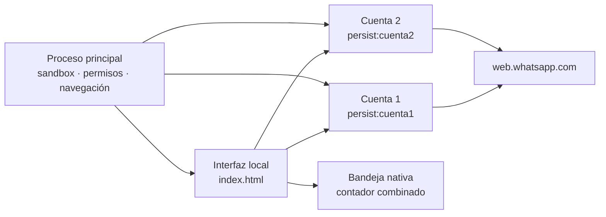

<p align="center">
  
</p>

<p align="center">
  <a href="README.md">English</a>
  ·
  <a href="#instalación">Instalación</a>
  ·
  <a href="#seguridad-y-privacidad">Seguridad</a>
  ·
  <a href="CONTRIBUTING.md">Contribuir</a>
</p>

<p align="center">
  <a href="https://github.com/seorooficial/whatsapp-duo/stargazers"></a>
  <a href="https://github.com/seorooficial/whatsapp-duo/network/members"></a>
  <a href="https://github.com/seorooficial/whatsapp-duo/releases/latest"></a>
  <a href="LICENSE"></a>
</p>

**WhatsApp Duo** es una pequeña aplicación Electron que reúne dos cuentas de
WhatsApp Web en una ventana de Linux. Cada cuenta utiliza una partición
persistente independiente, por lo que sus cookies, almacenamiento local y
sesión permanecen aislados.

No hay backend propio, API no oficial de WhatsApp, telemetría ni un Electron
empaquetado por duplicado. La aplicación abre el servicio oficial
`web.whatsapp.com` y utiliza el Electron mantenido por tu distribución.

<p align="center">
  
  <br>
  <sub>Vista ilustrativa con conversaciones ficticias. No contiene cuentas, códigos QR ni sesiones reales.</sub>
</p>

## Características

| | Función | Resultado |
| --- | --- | --- |
| **02** | Cuentas aisladas | Particiones persistentes distintas para las cuentas 1 y 2 |
| **⚡** | Arranque ligero | La segunda cuenta se retrasa para reducir la carga de CPU y GPU |
| **◉** | Bandeja nativa | Ocultar, ver los mensajes pendientes y salir limpiamente |
| **⌨** | Cambio rápido | Barra lateral o `Ctrl+1` / `Ctrl+2` |
| **◇** | Electron del sistema | No duplica un runtime de Electron de 200–300 MB |
| **▣** | Preparado para Wayland | Ozone nativo y valores conservadores para NVIDIA |
| **○** | Cero dependencias npm | Código pequeño y auditable, sin analítica |

## Instalación

### Arch Linux y CachyOS

Instala el metapaquete oficial de Electron y las herramientas básicas:

```bash
sudo pacman -S --needed electron git make
```

Clona, comprueba e instala:

```bash
git clone https://github.com/seorooficial/whatsapp-duo.git
cd whatsapp-duo
make check
sudo make install
```

Abre **WhatsApp Duo** desde el menú de aplicaciones o ejecuta:

```bash
whatsapp-duo
```

### Ejecutar sin instalar

Después de instalar Electron:

```bash
git clone https://github.com/seorooficial/whatsapp-duo.git
cd whatsapp-duo
./whatsapp-duo
```

El lanzador detecta `electron` y los ejecutables versionados de Arch desde
`electron38` hasta `electron43`.

### Desinstalación

Desde el directorio clonado:

```bash
sudo make uninstall
```

La desinstalación del programa **no** borra automáticamente los perfiles de
inicio de sesión, evitando que se pierdan sesiones activas por accidente.

## Uso

1. Abre la cuenta **1** y vincúlala mediante el QR de WhatsApp Web.
2. Cambia a la cuenta **2** y vincula la segunda cuenta.
3. Utiliza la barra lateral o `Ctrl+1` / `Ctrl+2` para cambiar.
4. Cierra la ventana para mantenerla en la bandeja; elige **Salir** en su menú
   para detenerla completamente.

## Seguridad y privacidad

El repositorio público nunca incluye perfiles de usuario ni sesiones de
dispositivos vinculados. Electron crea esos datos localmente tras el primer
arranque.

La aplicación aplica además estas restricciones:

- Sandbox de Electron y aislamiento de contexto activados.
- Node.js desactivado en la interfaz y en ambos webviews.
- Política CSP estricta para la interfaz local.
- Webviews restringidos a `https://web.whatsapp.com`.
- Ventanas nuevas bloqueadas; los enlaces HTTP(S) externos validados se abren
  en el navegador del sistema.
- Permisos limitados a las funciones necesarias y aceptados solamente desde el
  origen exacto de WhatsApp Web.
- Mensajes IPC validados contra la ventana local de confianza.

Comunica problemas de seguridad en privado siguiendo
[SECURITY.md](SECURITY.md). Nunca adjuntes códigos QR activos, cookies o
archivos de sesión a una incidencia.

## Arquitectura



## Crecimiento del proyecto

Los indicadores superiores utilizan datos en vivo de GitHub. Este gráfico se
actualizará conforme el proyecto reciba estrellas:

<p align="center">
  <a href="https://www.star-history.com/#seorooficial/whatsapp-duo&Date">
    <picture>
      <source media="(prefers-color-scheme: dark)" srcset="https://api.star-history.com/svg?repos=seorooficial/whatsapp-duo&type=Date&theme=dark">
      <source media="(prefers-color-scheme: light)" srcset="https://api.star-history.com/svg?repos=seorooficial/whatsapp-duo&type=Date">
      
    </picture>
  </a>
</p>

Si WhatsApp Duo te resulta útil, una estrella ayuda a que otros usuarios de
Linux lo encuentren.

## Contribuciones

Los informes de errores y pull requests concretos son bienvenidos. Lee
[CONTRIBUTING.md](CONTRIBUTING.md) antes de abrir uno.

## Licencia

Publicado bajo la [Licencia MIT](LICENSE).

## Aviso sobre marcas

WhatsApp Duo es un proyecto independiente y no oficial. No está afiliado,
autorizado, mantenido, patrocinado ni respaldado por WhatsApp LLC o Meta
Platforms, Inc. WhatsApp es una marca de su propietario correspondiente. El
proyecto utiliza un icono propio y emplea el nombre WhatsApp únicamente para
describir su compatibilidad con WhatsApp Web.
