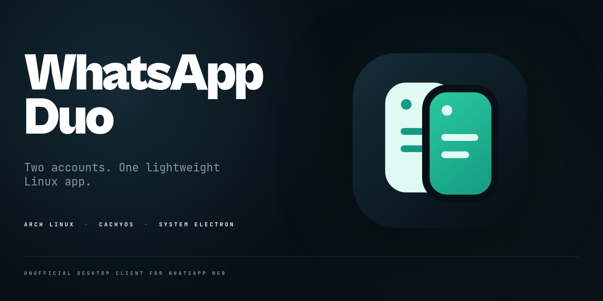
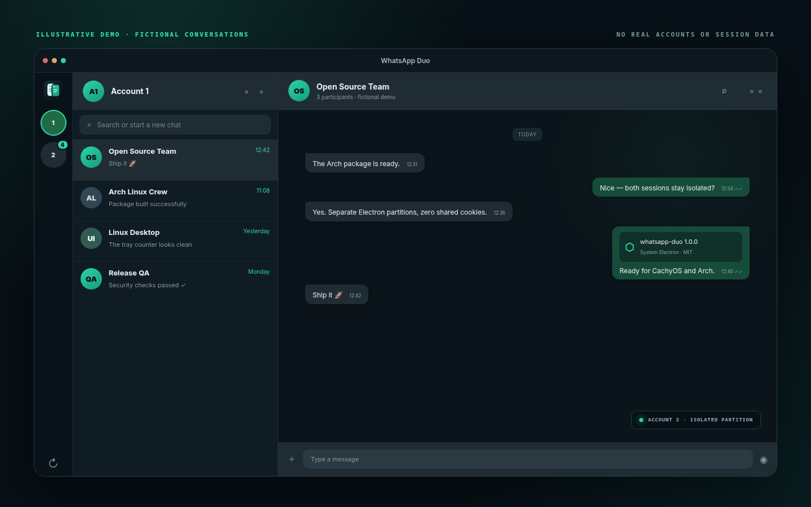
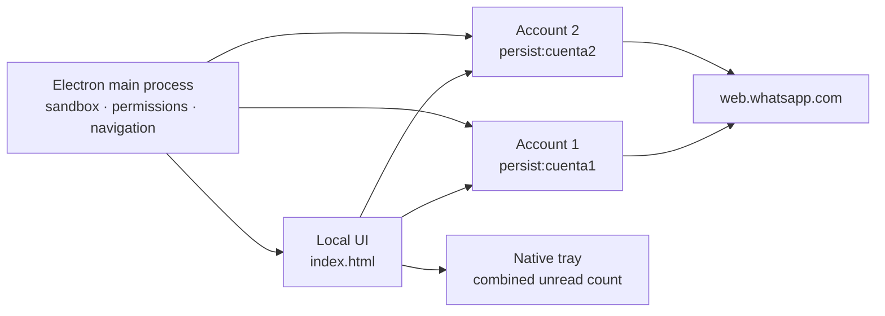

<p align="center">
  
</p>

<p align="center">
  <a href="README.es.md">Español</a>
  ·
  <a href="#installation">Install</a>
  ·
  <a href="#security-and-privacy">Security</a>
  ·
  <a href="CONTRIBUTING.md">Contribute</a>
</p>

<p align="center">
  <a href="https://github.com/seorooficial/whatsapp-duo/stargazers"></a>
  <a href="https://github.com/seorooficial/whatsapp-duo/network/members"></a>
  <a href="https://github.com/seorooficial/whatsapp-duo/releases/latest"></a>
  <a href="LICENSE"></a>
</p>

**WhatsApp Duo** is a small Electron shell that keeps two WhatsApp Web
accounts in one Linux desktop window. Each account uses its own persistent
Electron partition, so cookies, local storage and login state remain isolated.

There is no custom backend, unofficial WhatsApp API, telemetry or bundled
Electron runtime. The application opens the official `web.whatsapp.com`
service and uses the Electron package maintained by your Linux distribution.

<p align="center">
  
  <br>
  <sub>Illustrative preview with fictional conversations. No real account, QR code or session data is included.</sub>
</p>

## Highlights

| | Feature | What it means |
| --- | --- | --- |
| **02** | Isolated accounts | Separate persistent partitions for account 1 and account 2 |
| **⚡** | Lightweight startup | The second account is delayed to reduce CPU/GPU contention |
| **◉** | Native tray | Hide to tray, see the combined unread count and quit cleanly |
| **⌨** | Fast switching | Use the rail or `Ctrl+1` / `Ctrl+2` |
| **◇** | System Electron | No duplicated 200–300 MB Electron bundle |
| **▣** | Wayland friendly | Native Ozone support with conservative NVIDIA defaults |
| **○** | Zero npm dependencies | Small, auditable source tree with no analytics |

## Installation

### Arch Linux and CachyOS

Install the official Electron meta-package and the basic build tools:

```bash
sudo pacman -S --needed electron git make
```

Clone, verify and install:

```bash
git clone https://github.com/seorooficial/whatsapp-duo.git
cd whatsapp-duo
make check
sudo make install
```

Launch **WhatsApp Duo** from your application menu or run:

```bash
whatsapp-duo
```

### Run without installing

After installing Electron:

```bash
git clone https://github.com/seorooficial/whatsapp-duo.git
cd whatsapp-duo
./whatsapp-duo
```

The launcher detects `electron` and the versioned Arch executables from
`electron38` through `electron43`.

### Uninstall

From the cloned source directory:

```bash
sudo make uninstall
```

Uninstalling the program does **not** remove login profiles automatically.
This protects users from losing active sessions by accident.

## Usage

1. Open account **1** and link it with the QR flow shown by WhatsApp Web.
2. Switch to account **2** and link the second account.
3. Use the left rail or `Ctrl+1` / `Ctrl+2` to switch.
4. Close the window to keep it running in the tray; choose **Quit** from the
   tray menu to stop it completely.

## Security and privacy

The public repository never includes user profiles or linked-device sessions.
Runtime data is created locally by Electron after the first launch.

The application also applies the following restrictions:

- Electron sandbox and context isolation enabled.
- Node.js disabled in the renderer and both webviews.
- Strict Content Security Policy for the local interface.
- Webviews restricted to `https://web.whatsapp.com`.
- New windows denied; validated external HTTP(S) links open in the system
  browser.
- Permission requests limited to the features required by WhatsApp Web and
  accepted only from its exact origin.
- IPC messages validated against the trusted local window.

Please report security issues privately by following [SECURITY.md](SECURITY.md).
Do not include live QR codes, cookies or session files in an issue.

## Architecture



## Project growth

The badges at the top use live GitHub data. This chart updates as the project
receives stars:

<p align="center">
  <a href="https://www.star-history.com/#seorooficial/whatsapp-duo&Date">
    <picture>
      <source media="(prefers-color-scheme: dark)" srcset="https://api.star-history.com/svg?repos=seorooficial/whatsapp-duo&type=Date&theme=dark">
      <source media="(prefers-color-scheme: light)" srcset="https://api.star-history.com/svg?repos=seorooficial/whatsapp-duo&type=Date">
      
    </picture>
  </a>
</p>

If WhatsApp Duo is useful to you, a star helps other Linux users discover it.

## Contributing

Bug reports and focused pull requests are welcome. Read
[CONTRIBUTING.md](CONTRIBUTING.md) before opening one.

## License

Released under the [MIT License](LICENSE).

## Trademark notice

WhatsApp Duo is an independent, unofficial project. It is not affiliated with,
authorized, maintained, sponsored or endorsed by WhatsApp LLC or Meta
Platforms, Inc. WhatsApp is a trademark of its respective owner. The project
uses its own original icon and uses the WhatsApp name only to describe
compatibility with WhatsApp Web.
